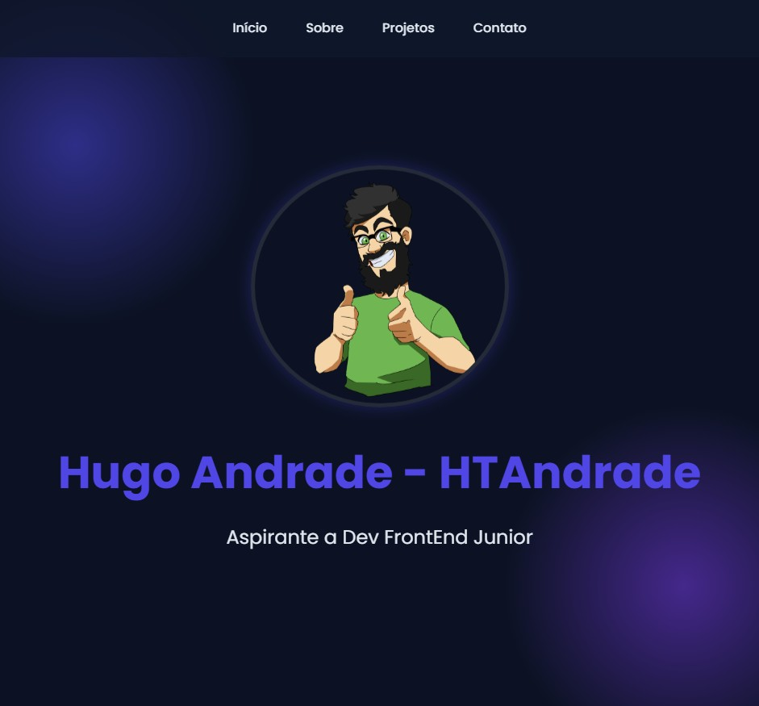

<h1 align="center"> Portólio </h1>

Página de portfólio responsiva criada para inclusão dos meus projetos durante o aprendizado como Dev Front-End.

  <a href="#-tecnologias">Tecnologias</a>&nbsp;&nbsp;&nbsp;|&nbsp;&nbsp;&nbsp;
  <a href="#-projeto">Projeto</a>&nbsp;&nbsp;&nbsp;|&nbsp;&nbsp;&nbsp;
  <a href="#memo-licença">Licença</a>

  

 

## 🚀 Tecnologias

Esse projeto foi desenvolvido com as seguintes tecnologias:

- HTML e CSS
- JavaScript
- Git e Github

## 💻 Projeto

A página de portfólio foi criada para apresentação dos projetos e possível contato futuro.

## :memo: Licença

Esse projeto está sob a licença MIT.

---

Feito com ♥ by Hugo Andrade :wave:
